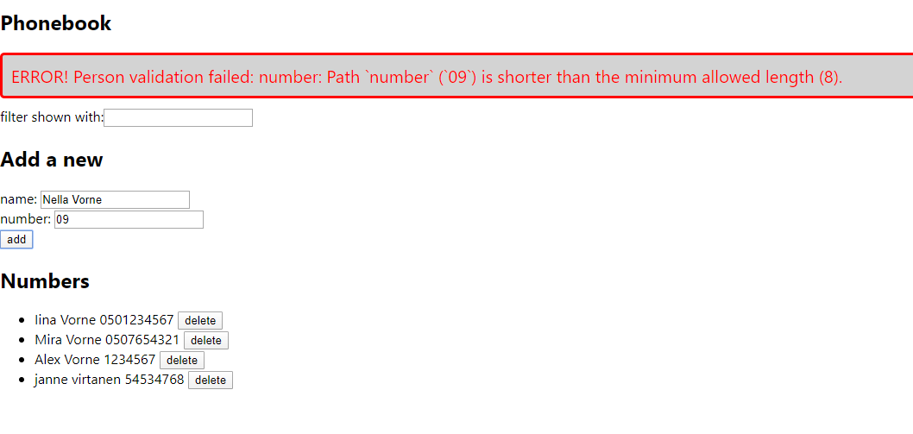

# Web-sovellukset 2020 

## Valmistaudu jaksoon
Tee GitHubiin repositorio nimeltä Web-sovellukset ja sen alle kaksi kansiota: 
  * Tutorial
  * Projekti

Tutorial-tehtävät nimetään tehtävän mukaan, esim. teht1.html ja palautetaan GitHubiin tehtävän mukaan nimettyyn kansioon, esim. /Tutorial/Teht1/teht1.html. 
  
Projekti on koko jakson ajan laajentuva tehtävä, jonka seuraava versio voidaan tallentaa aina edellisen päälle. Projektia tehdään siis iteratiivisesti.

## Sisältö ja tehtävät
1. **Tehtävä: HTML tutorial**
  * Katso tutorial: https://youtu.be/UB1O30fR-EE
  * Tee HTML-sivu videon ohjeiden mukaisesti.
  * Palauta GitHubiin /Tutorial/teht1/ -kansioon.  
2. **Tehtävä: Projektin HTML** 
  * Aloita koko jakson kestävä, Websovelluksena toteutettu, Yhteystieto-projekti tekemällä kuvan mukainen HTML-sivu. 
  * Nimeä HTML-sivu nimellä index.html ja palauta repositoriosi Projekti-kansioon.

3. **Tehtävä: CSS tutorial**
  * Katso tutorial: https://youtu.be/yfoY53QXEnI
  * Tee videon tyylitiedostoharjoitus.
  * Palauta GitHubiin /Tutorial/teht3/ -kansioon.
4. **Tehtävä: Projektin CSS** 
  * Tee projektisi index.html tiedostoon ulkoinen tyylitiedosto. Muokkaa:
  * Taustakuva
  * Otsikoiden fontti, väri ja koko. Keskitä otsikot keskelle sivua. 
  * Leipätekstin fontti tyyli ja koko.
  * Tee listan bulleteista kuvia.
  * Tee jokaisesta sivun osiosta div, jossa on pyöreät kulmat ja taustakuvasta erottuva taustaväri: Phonebook, Add a new, Numbers
  * Muokka lomakkeiden kenttien reunojen väriä.
  * Tee nappuloista mustia valkoisella tekstillä.
  * Palauta GitHubiin Projekti-kansioon.

5. **Tehtävä: BOOTSTRAP**
  * Katso tutorial: https://youtu.be/5GcQtLDGXy8
  * Tee videon Bootstrap-harjoitus.
  * Palauta GitHubiin /Tutorial/teht5/ -kansioon.
  * EI PROJEKTITEHTÄVÄÄ

7. **Tehtävä: JAVASCRIPT**
  * Katso tutorial: https://youtu.be/hdI2bqOjy3c
  * Tee videon JavaScript-harjoitus.
  * Palauta GitHubiin /Tutorial/teht6/ -kansioon.
  * EI PROJEKTITEHTÄVÄÄ

8. **Tehtävä: JSON**
  * Katso tutorial: https://youtu.be/wI1CWzNtE-M
  * Tee videon JSON-harjoitus.
  * Palauta GitHubiin /Tutorial/teht8/ -kansioon.
  * EI PROJEKTITEHTÄVÄÄ

9. **Tehtävä: REACT JS**
  * Katso tutorial: https://youtu.be/sBws8MSXN7A
  * Tee videon React JS-harjoitus.
  * Palauta GitHubiin /Tutorial/teht9/ -kansioon.
10. **Tehtävä: Projektin React JS** 
  * Tee projektisi frontend React JS:lla: kovakoodatulla datalla, ei vielä toiminnallisuutta.
    
11. **Tehtävä: NODE.JS**
  * Katso tutorial: https://youtu.be/fBNz5xF-Kx4
  * Tee videon Node.js-harjoitus.
  * Palauta GitHubiin /Tutorial/teht11/ -kansioon.
12. **Tehtävä: Projektin Node.js** 
  * Tee projektisi backend Node.js:llä.

13. **Projekti**
  * Tee projektiin lisää -toiminnallisuus, eli lomakeelta voi lisätä lisää yhteystietoja.

14. **Projekti**
  * Tee projektiin poista -toiminnalisuus.

15. **Projekti**
  * Tee projektiin filter -toiminnallisuus.

16. **Projekti**
  * Tee projektiin Notification -toiminnallisuus
    * Yhteystieto lisätty
    * Liian lyhyt nimi
    * Liian lyhyt puhelinnumero
    * Nimi tai numero puuttuu
    * Yhteystieto poistettu 
    * Notification poistuu sivulta 5 sek. kuluttua.

    
    

17. **Projekti**
    * Toggle -toiminnallisuus
    * Näytä / piilota uuden yhteystiedon lisäyslomake nappia painamalla.
